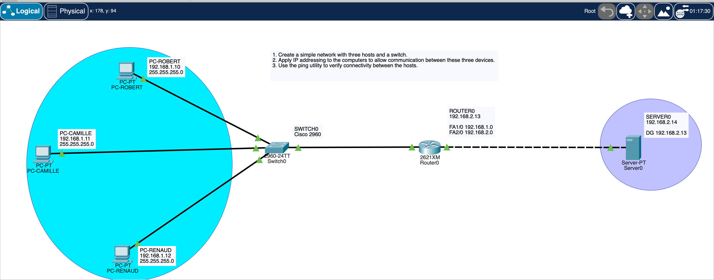

We created a simple network project for only three people working on it.

Robert Tappan Morris, the CEO, insists on the fact that Hackers Poulette is bound to grow, that the ambitions of the startup are great. 

So he wants an installation that is __easily scalable__ . All three hosts must also be connected to the internet.

## What
`simple_network` is a project made at BeCode that allow us to undersand the basics of Cisco Packet Tracer

It is structured by respecting the requirements of the project :

We understand that we have to :

- Have 3 different hosts
- Apply IP addressing
- Be able to configure interconnectivity between hosts.
- Be able to connect hosts to the internet

## Why
Discover the power and the functionnalities of Cisco Packet Tracer, discover the possibilities, have a global vision of the Nework architecture.

## When
Project started & finished second week of March 2024

## How

**Addressing table :**

| Devices | LAN | IP | Mask |
|---------|-----|----|------|
| PC-Robert | Eth | 192.168.1.10 | 255.255.255.0 | 
| PC-Camille | Eth | 192.168.1.11 | 255.255.255.0 |
| PC-Renaud | Eth | 192.168.1.12 | 255.255.255.0 |
| Router0 | Eth |192.168.2.13 | 255.255.255.0 |
| Server0 | Eth | 192.168.2.14 | 255.255.255.0 |

**Resource Requirements (updated) :**
- 1 switch (Cisco 2960)
- 3 PCs
- Three Ethernet cables
- 1 Server
- 1 Router

### Must-have features

- Connect our server to the real world (internet configuration)

### Nice to have features

- Make a script to automate the configuration 

## This is DONE ! LET'S MOVE ON !

)
